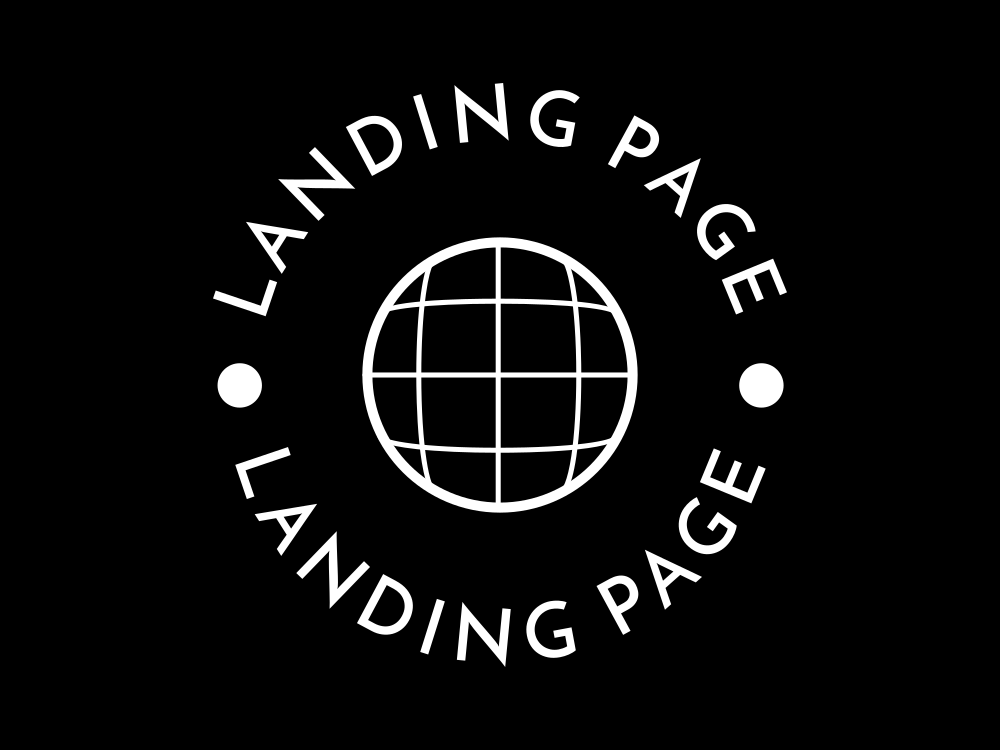
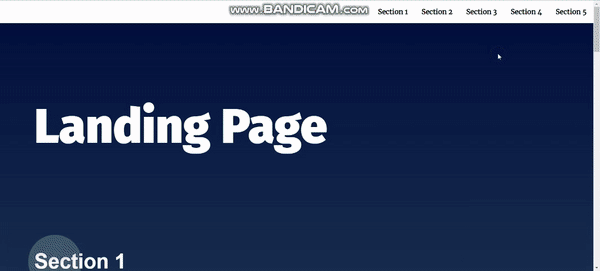

# Project Title

Landing page

## Authors

- [@Ahmed Mohsen](https://www.linkedin.com/in/ahmed-mohsen-a4aa33249/)

## Installation

Install landing page by just download it and head to index.html and run in live server

## Demo

## Contributing

This project forked from https://github.com/udacity/cd0428-landing-page/

Contributions are always welcome!

## License

[See License.txt](https://github.com/ahmed-mohsen88/cd0428-landing-page/blob/main/LICENSE.txt)

## 🔗 Links

## 🚀 About Me

I'm a full stack developer...
